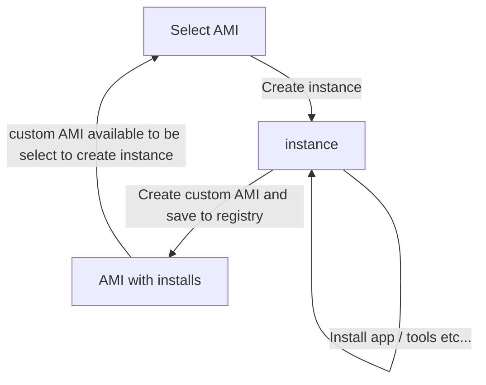

# React deployment and scaling to Next.js

You are the founding engineer, here are your tasks....

## Create react app deployment

- Create a new react app with [CRA](https://create-react-app.dev/docs/getting-started)
- You can build and deploy to [github pages](https://create-react-app.dev/docs/deployment#github-pages)
- Whch you have already, ex. [your portfolio example](https://github.com/sophie-tsai/Portfolio/tree/gh-pages)
- Github is hosting the static content, replacing S3
- In react's deployment docs you can also "serve" the content with a [static server](https://create-react-app.dev/docs/deployment/#static-server)
- It may seems magical but here's the same function explicitly written in [express](https://create-react-app.dev/docs/deployment/#other-solutions)
- This is very much like how Next.js runs
- Let's mimic a Next.js deployment by running this on a server

## Running "Next.js" simple in EC2

- First create a server
  - [Launch an instance](https://docs.aws.amazon.com/AWSEC2/latest/UserGuide/EC2_GetStarted.html#ec2-launch-instance)
  - Make you sure you allow http ports and enable public IP, everything is "off" by default
- Then you need to install [node/npm on ec2](https://docs.aws.amazon.com/sdk-for-javascript/v2/developer-guide/setting-up-node-on-ec2-instance.html)
- Now serve the page

## Fountains for Docker images

- Pretend you set this up and might need to do it 6 months later... you might forget right?
- You could document it, but isn't better to "save" it?
- You can do that by [creating an ami](https://docs.aws.amazon.com/toolkit-for-visual-studio/latest/user-guide/tkv-create-ami-from-instance.html)
- Now when you need the exact same application, it is one-click to get it, no installs needed
- This is like creating an iphone backup

## Scaling

- Suppose the CRA app is a hit and everyone is trying to access it, how do we scale it?
- We have a way of quickly creating a duplicate app, but we cannot give every person a different URL
- We need a single URL / access point for everyone but that request to direct to which ever server is able to handle it
- This is called a [load balancer](https://www.cloudflare.com/learning/performance/what-is-load-balancing/)
- Creating one is a bit more involved, but it's important to understand the concepts

## Docker foundations

- Understanding the AMI sets the foundation for understanding Docker, which is key in k8 and very helpful in local backend development



- To create a EC2 server, you select an AMI, and create an instance
- Then you can install / add your build code to the instance
- Then from that instance you can create an AMI
- Which you can then use to create an instance

Docker images are very much similar...

EC2 instance = Docker container
AMI = Docker image

- Ask copilot to
  - (Before you do all these look at the bottom link)
  - run an amazon linux 2023 image
  - connect to it
  - Install node on it
  - Create a dockerfile that start with amazon linux 2023 image and install node on it
  - Then create an image from it
  - Then run that image, connect to it and verify it has node
  - This should be similar to the tutorial below
- [Dockerize a react application](https://www.freecodecamp.org/news/how-to-dockerize-a-react-application/)

  - Skip pushing the image to docker hub / creating a docker hub account

- Optional tutorials / helpful guides
- [Building docker images](https://stackify.com/docker-build-a-beginners-guide-to-building-docker-images/#:~:text=Docker%20builds%20images%20by%20reading,two%20components%3A%20instruction%20and%20argument.&text=%E2%80%9CRUN%E2%80%9D%20in%20the%20instruction%20and,npm%20install%E2%80%9D%20is%20the%20argument.)
- [Docker introduction](https://karanjagtiani.medium.com/introduction-to-docker-a-beginners-guide-for-2023-cbf9be911352)

## ECS versus EC2

- Ask copilot about the similiarities and differences of EC2 and ECS
- Now we can deploy a docker container in AWS ECS
  - [Deploy an app on ECS](https://medium.com/@inderjotsingh141/aws-ecs-hands-on-5b2194b905ad#:~:text=in%20your%20cluster.-,Service,Application%20Load%20Balancer%20(ALB)

## Next.js intro

- The [main features](https://nextjs.org/docs) of Next.js are the following...
  - more "?" = more unknown... Which we will get to

1. Routing
2. Rendering??
3. Data fetching??
4. Styling
5. Optimizations?
6. Typescript

- Lets first just [setup a project from scratch](https://nextjs.org/docs/getting-started/installation) and run it locally
  - 💡 = what Next.js does
  - 💡: it helps you create the app, where the alternative was `$ npx create-react-app`
  - Note, "start: runs next start to start a Next.js production server."
  - 💡: Next.js includes the production server, where we used `$ serve -s build -l 4000` or `express` in the create react app deployment far above

## Next.js deployment options

- Now lets deploy Next.js, see [deployment](https://nextjs.org/docs/app/building-your-application/deploying)
- It is easy to deploy to Vercel as they are "the creators and maintainers of Next.js" but that can become expensive and some company require you be on one cloud provider ex. AWS
- Let's look at the options for

2. Self-Hosting

- [Node.js server](https://nextjs.org/docs/app/building-your-application/deploying#nodejs-server)
- We can deploy this on EC2 very easily
- [Docker Image](https://nextjs.org/docs/app/building-your-application/deploying#docker-image)
- We can deploy this on ECS
- [Static html Export](https://nextjs.org/docs/app/building-your-application/deploying#static-html-export)
- We can deploy this on S3

- STUCK RIGHT HERE
- Now we try deploying
  `$ npx create-next-app --example with-docker nextjs-docker`
- [Follow "How to use](https://github.com/vercel/next.js/tree/canary/examples/with-docker#how-to-use)
- Which gets you the code if you did
- `$ git clone https://github.com/vercel/next.js.git`
- `$ cd examples/with-docker`

- Run it locally
- `$ npm i && npm run dev`

- To deploy on EC2 we can just repeat the about on the server (but not a standard way to do this)
- Lets do a "fine" practice way to deploy to ECS

## Next.js ECS deployment

Change from port 3000 to 80

In `Dockerfile`

```Dockerfile
EXPOSE 80

ENV PORT=80
```

In `app.json`

```json
"port": 80,
```

- [Follow "Using Docker"](https://github.com/vercel/next.js/tree/canary/examples/with-docker#using-docker)
- Now create a docker account
- `$ docker login`
- Tag the image
- `$ docker tag nextjs-docker:1.0 ryanzhou7/nextjs-docker:1.0`
- Push the image to a public repository
  - `$ docker push ryanzhou7/nextjs-docker:1.0`
- Now we can follow [this to deploy to ECS](<https://medium.com/@inderjotsingh141/aws-ecs-hands-on-5b2194b905ad#:~:text=in%20your%20cluster.-,Service,Application%20Load%20Balancer%20(ALB)>)
- BUT, given Hub URL vs URI you enter

```
https://hub.docker.com/r/acantril/containerofcats
docker.io/acantril/containerofcats
https://hub.docker.com/r/ryanzhou/nextjs-docker
docker.io/ryanzhou/nextjs-docker
```

- [See unsupported features](https://nextjs.org/docs/app/building-your-application/deploying/static-exports#unsupported-features)

- [Next.js in 100 Seconds + tutorial](https://www.youtube.com/watch?v=Sklc_fQBmcs)

  - Server rendering strategies
    - SSG: static generation - render all pages at build time
      - getStaticProps
      - good for blog
    - SSR: server side rendering - generate each page at request time
      - getServerSideProps
      - latest data, but not if to much data / changes
    - ISR: Incremental static regeneration - re-generate single pages in the background

- [Next.js 13 the full tutorial - latest](https://www.youtube.com/watch?v=__mSgDEOyv8)

- [Data fetching run on server](https://nextjs.org/docs/pages/building-your-application/data-fetching/get-static-props#write-server-side-code-directly)

- [Auth0 tutorial mentioning audience, scopes](https://developer.auth0.com/resources/guides/spa/react/basic-authentication)
  - connects other back
- [Next.js starter templates](https://vercel.com/templates/next.js)

## Static deployment in AWS

- [Simple static website in S3](https://docs.aws.amazon.com/AmazonS3/latest/userguide/HostingWebsiteOnS3Setup.html)
- [Deploy react based SPA](https://docs.aws.amazon.com/prescriptive-guidance/latest/patterns/deploy-a-react-based-single-page-application-to-amazon-s3-and-cloudfront.html)

  - IaC example in cloud formation, basic API gateway example
  - devOps? "ClickOps" far above
  - Note [Amplifiy](https://create-react-app.dev/docs/deployment/#aws-amplify)'s "offers globally available CDNs, custom domain setup, feature branch deployments, and password protection."
  - [Advanced Amplify, auth, data, storage, etc...](https://docs.amplify.aws/react/how-amplify-works/concepts/#build-an-app)

- [Fireship Next.js rendering](https://fireship.io/courses/nextjs/basics-next-100s/)

- https://geshan.com.np/blog/2023/01/nextjs-docker/
- https://nextjs.org/learn/dashboard-app/fetching-data
